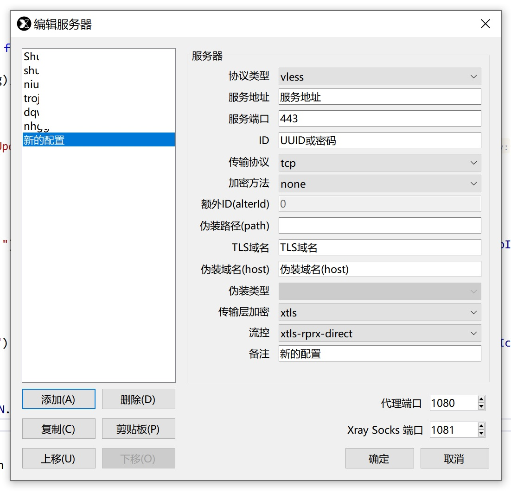

XrayShell
==============================

[中文说明](README_ZH.md)

## What is this?

This is a little shell application for [xraycore](https://github.com/XTLS/Xray-core).

But user interface more like shadowsocks-windows.

Very simple but small and exquisite 😜

This is a Copy&Paste Oriented Application

I'm a Copy&Paste Oriented Programmer

Nobody👐knows🙌zhuangbi☝better👌than me, 'Dashen' Go Away Plz