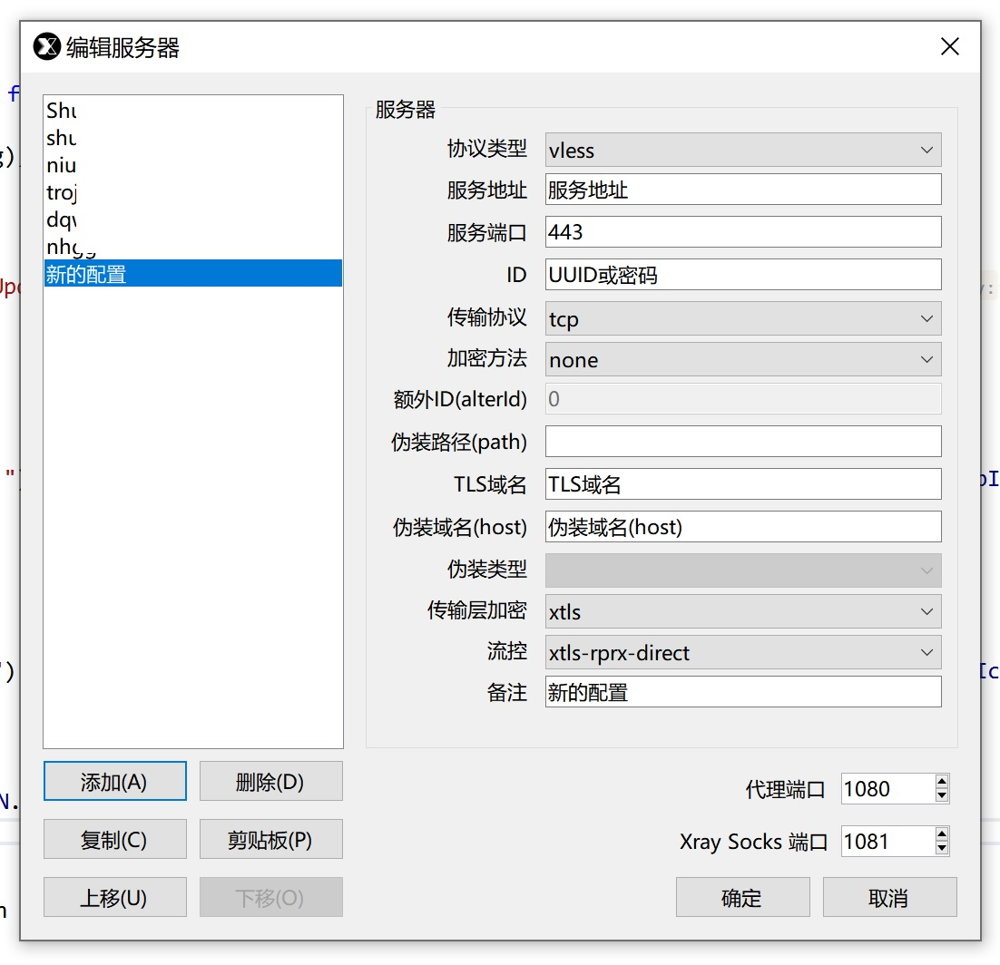

XrayShell
==============================

## 这是个啥

这是一个 [XrayCore](https://github.com/XTLS/Xray-core) 的外壳程序

虽然是Xray扩展，但是UI更加偏向于 shadowsocks-windows （界面及使用习惯几乎一模一样）

虽然很简单但是能够满足日常基本需求，也算是小巧玲珑(610KB) 😜

作为一个面向复制粘贴程序员，我可以很负责地说这是一个面向复制粘贴的软体

综上所述，“大神”们请无视本仓库，谢谢

## 怎么用？

1. 找大神PY一个vless/vmess/trojan的服务器（类似vmess://这样的链接，复制下来）
2. 下载XrayShell，然后双击运行
3. 等待程序自己下载更新Xray-core（正常情况下应该十来秒就能下载完）
4. 第一次运行弹出服务器配置，干掉默认配置，点击“剪贴板”，此时会从从剪贴板读取到服务器配置
5. 点确定程序会进入后台运行，这时候可以右键系统托盘图标启动系统代理或者浏览器插件接管代理，然后就可以网上冲浪了

## 和同类软件相比，有哪些不一样？

- 精简掉了统计功能（对我来说几乎用不上）
- 舍弃了精美UI（对我来说用不上）
- 各种围绕Xray的扩展（例如使用Grpc框架与XrayCore进行通信等）
- 去掉了对本机回环ipv6的支持（对我来说用不上）
- 使用pac对系统网络进行规则访问（与ss-win保持一致）
- 加入了一些常用快捷键（与ss-win保持一致）

从这几点不难看出：对于我来说，我不需要去随时盯着流量图表来科学使用我仅有的几个节点，我也不想随身携带一个动辄几十M的软件包到处跑，我只需要一个能安安静静躺在后台为我提供服务的工具。

## 如果你对本程序精简掉的功能不满意？

没关系，可以前往 [官方文档](https://xtls.github.io/guide/) 学习更多姿势 🤞
